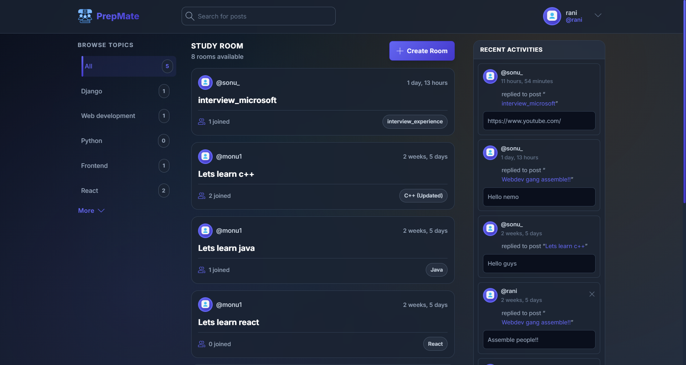

# PrepMate
**PrepMate** is a full-stack web application designed to enhance collaborative learning. It allows students to join interactive study rooms, engage in topic-wise discussions, and track their learning activities — all in one place.



---

## Features

- **Interactive Study Rooms** — Join or create rooms based on specific topics
- **Discussion Threads** — Post messages and view others' responses (refresh-based)
- **User Authentication** — Login, logout, and session-based access control
- **Topic-based Filtering & Search** — Quickly find relevant discussions
- **User Profiles** — View user info and their recent activity
- **Responsive UI** — Clean, accessible interface using Django templates and CSS

---

## Tech Stack

| Layer        | Technology         |
|-------------|--------------------|
| Backend      | Django (Python)    |
| Frontend     | Django Templates + HTML/CSS |
| Database     | SQLite (dev)       |
| Version Control | Git & GitHub    |

---

| Login Page | Study Room |
|-----------|------------|
|  |  |

---

## Getting Started (Local Setup)

1. **Clone the repository**
   ```bash
   git clone https://github.com/yourusername/prepmate.git
   cd prepmate
2. **Set up Virtual environment**
   python -m venv env
   source env/bin/activate
3. **Install dependencies**
   pip install -r requirements.txt
4. **Run migrations**
   python manage.py makemigrations
   python manage.py migrate
5. **Run Server**
   python manage.py runserver
